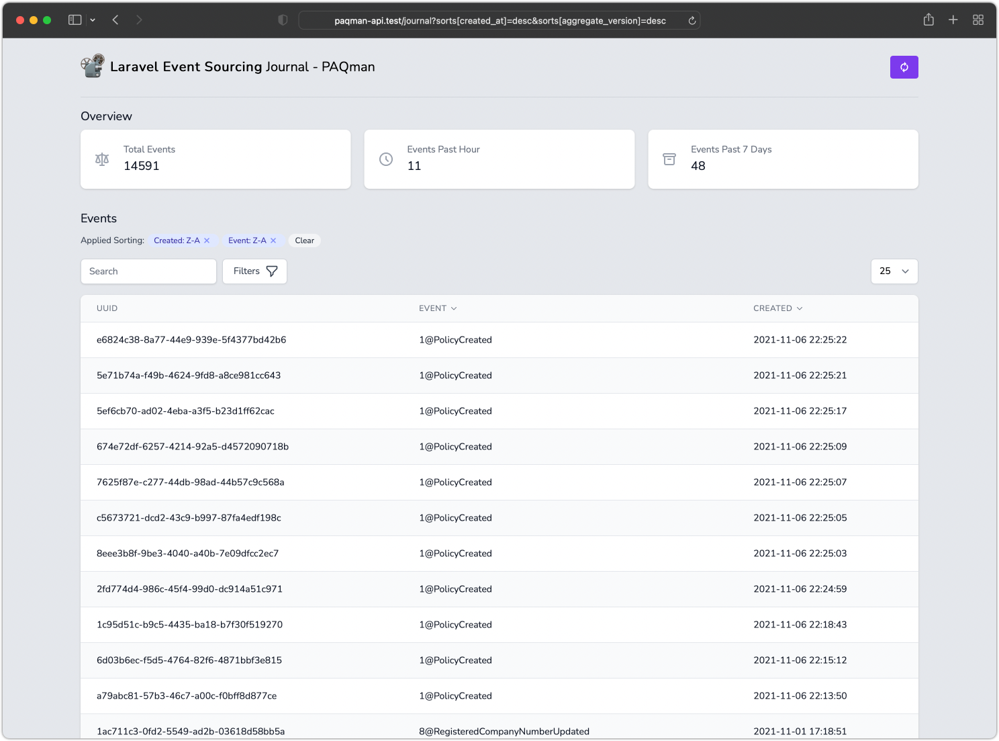
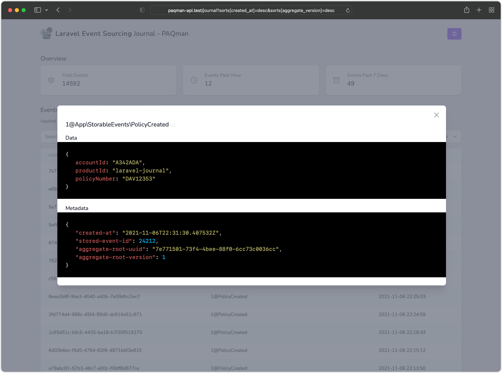

# A UI for Spatie's Laravel Event Sourcing

[](https://packagist.org/packages/morrislaptop/journal)
[](https://github.com/morrislaptop/journal/actions?query=workflow%3Arun-tests+branch%3Amain)
[](https://github.com/morrislaptop/journal/actions?query=workflow%3A"Check+%26+fix+styling"+branch%3Amain)
[](https://packagist.org/packages/morrislaptop/journal)

---
Journal makes a wonderful companion to your local Laravel Event Sourcing development environment. Journal provides insight into the events coming into your application.




## Installation

You can install the package via composer:

```bash
composer require morrislaptop/journal
```

After installing Journal, publish its assets using the `journal:install` Artisan command.

```bash
php artisan journal:install
```

### Local Only Installation

If you plan to only use Journal to assist your local development, you may install Telescope using the `--dev` flag:

    composer require morrislaptop/journal --dev
    php artisan vendor:publish --provider="Morrislaptop\Journal\JournalServiceProvider" --tag="journal-config"

### Dashboard Authorization

The Journal dashboard may be accessed at the `/journal` route. By default, you will only be able to access this dashboard in the `local` environment. Within your `app/Providers/JournalServiceProvider.php` file, there is an [authorization gate](https://laravel.com/docs/8.x/authorization#gates) definition. This authorization gate controls access to Journal in **non-local** environments. You are free to modify this gate as needed to restrict access to your Journal installation:

    /**
     * Register the Journal gate.
     *
     * This gate determines who can access Journal in non-local environments.
     *
     * @return void
     */
    protected function gate()
    {
        Gate::define('viewJournal', function ($user) {
            return in_array($user->email, [
                'cr@igmorr.is',
            ]);
        });
    }

> You should ensure you change your `APP_ENV` environment variable to `production` in your production environment. Otherwise, your Journal installation will be publicly available.

#### Alternative Authentication Strategies

Remember that Laravel automatically injects the authenticated user into the gate closure. If your application is providing Journal security via another method, such as IP restrictions, then your Journal users may not need to "login". Therefore, you will need to change `function ($user)` closure signature above to `function ($user = null)` in order to force Laravel to not require authentication.

## Testing

```bash
composer test
```

## Changelog

Please see [CHANGELOG](CHANGELOG.md) for more information on what has changed recently.

## Contributing

Please see [CONTRIBUTING](.github/CONTRIBUTING.md) for details.

## Security Vulnerabilities

Please review [our security policy](../../security/policy) on how to report security vulnerabilities.

## Credits

- [Craig Morris](https://github.com/morrislaptop)
- [All Contributors](../../contributors)

## License

The MIT License (MIT). Please see [License File](LICENSE.md) for more information.
